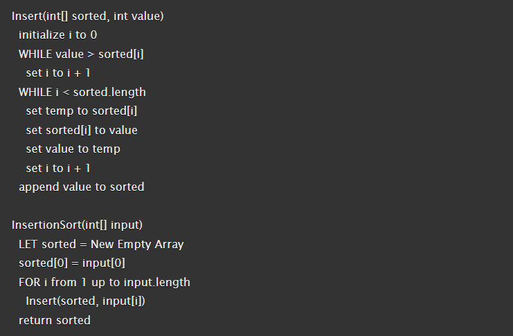
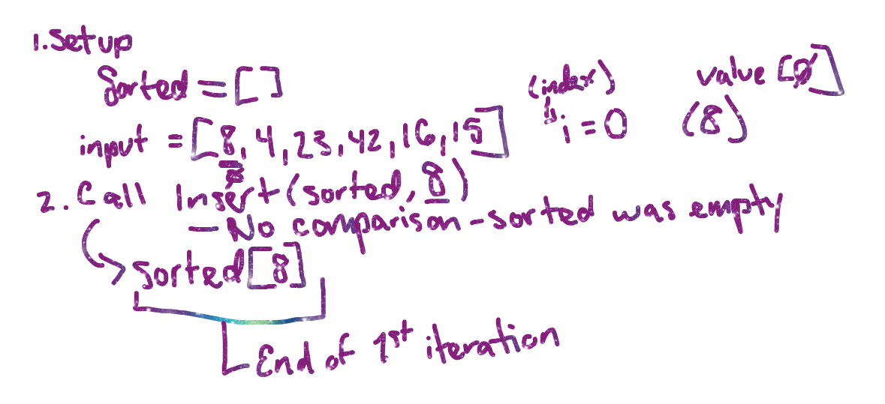
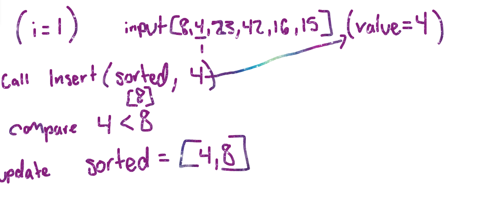
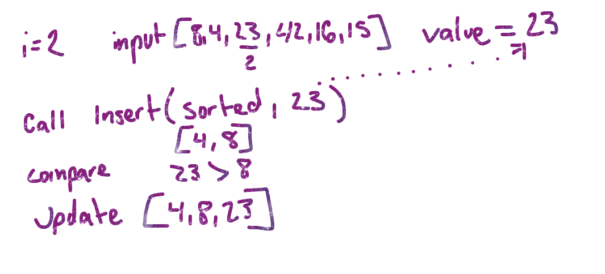

# Assignment

Review the pseudocode below, then trace the algorithm by stepping through the process with the provided sample array. Document your explanation by creating a blog article that shows the step-by-step output after each iteration through some sort of visual.

## Pseudocode

Steps to sort the input array of: [8,4,23,42,16,15]

Step1: Setup

declare an empty array named 'sorted'

Array<Integer> sorted = new Array<Interger>();

Step2: Use the InsertionSort method

Iterate through the input array '[8,4,23,42,16,15]':

-Iteration 1 (i=0):
Call Insert(sorted, 8) - call insert method passing the array and first index value.
In the Insert method, value = 8  - value takes the integer passed in (8), since 'sorted' is empty, 'value' is appended
(i + 1) -ensures the index moves to the next position gaining 1 index position
'sorted: [8]' - current state of sorted array

-Iteration 2 (i = 1):
Call Insert(sorted, 4) - call Insert method passing the modified sorted array and the next index value (4)
In the Insert method, value = 4 - since 4 < 8, 4 gets inserted before 8
(i + 1) -ensures the index moves to the next position gaining 1 index position
'sorted: [4,8]' - updated state of sorted array

-Iteration 3 (i =2):
Call Insert(sorted, 23) - call Insert method passing the modified sorted array and the next index value (23)
In the Insert method, value = 23 - since 23 > 8, value is inserted after 8
(i + 1) -ensures the index moves to the next position gaining 1 index position
'sorted: [4,8,23]' - updated stated of the sorted array

## Big-O

Time: O(n)
Space: O(n)

## Code

## Resources
-ChatGPT (explaining process)

