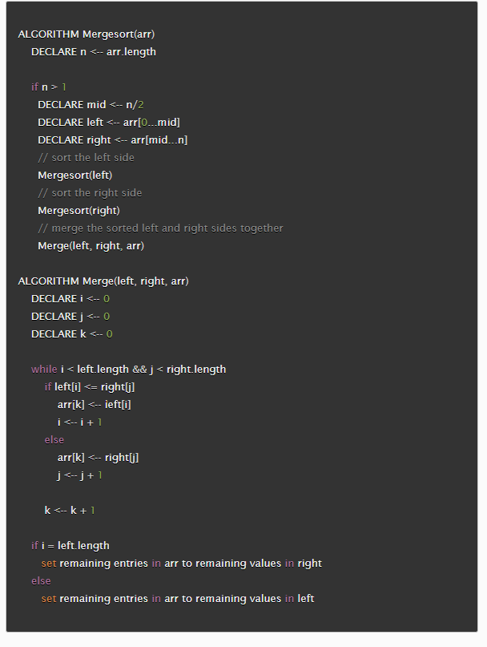
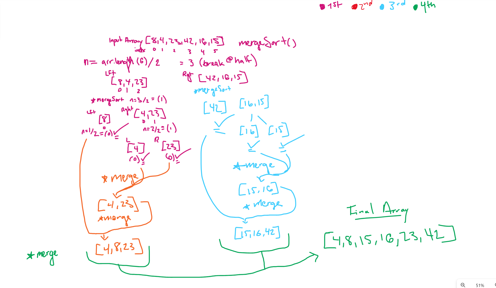

# Assignment

Review the pseudocode below, then trace the algorithm by stepping through the process with the provided sample array. Document your explanation by creating a blog article that shows the step-by-step output after each iteration through some sort of visual.

## Pseudo Code

## Steps to execute mergesort

Merge-sort is a divide and conquer algorithm, works by dividing the array into smaller sub-arrays, sorts them individually,
then re-merges in a sorted order.

- Step 1: invoke Mergesort with the input array of [8, 4, 24, 42, 16, 15]
Find the middle by dividing the array length in 2 halves, right side and left side
Left [8,4,23]   and   Right [42,16,15]
Recursively call Mergesort on both halves.

- Step 2: Divide until one element is left

Left-side 1st divide:
Left [8]   and Right [4, 23]
Call Mergesort on each half.

- Step 3:
We reached the base case of [8] so array is sorted.

- Step 4:
Left (Right sub-array) [4, 23]
Left [4] and right [23] (One element in the array case is reached)

- Step 5: Merge [4] and [23] back together
We will directly compare the values and merge them back lowest being on the left
[4,23]

- Step 6: Merge [8] and [4, 23] back together (the value of 8 (k) is compared to both 4, 23 - will go in middle as greater than i but less than j)
[4, 8, 23]

- Step 7: Now we address the right half [42, 16, 15]
Right (left sub-array) will be [42] reached base case

- Step 8: Sort the right sub array [16, 15]
This will divide into left [16] and right [15]

- Step 9: Merge [16] and [15] back together - compare and merge
[15, 16]

- Step 10: Compare and merge [42] and [15, 16] back together
[15, 16, 42]

- Step 11: Merge the original halves (now sorted back together) [4, 8, 23] and [15, 16, 42] to get the final array.
[4, 8, 15, 16, 23 42] - Final sorted array

### Big-O
Time- O(n log n)
Space- O(n log n)

### Resources
ChatGPT
